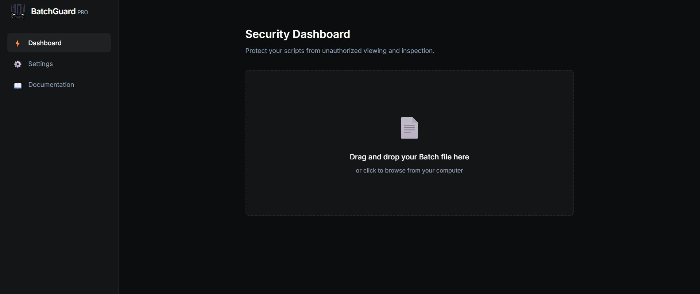
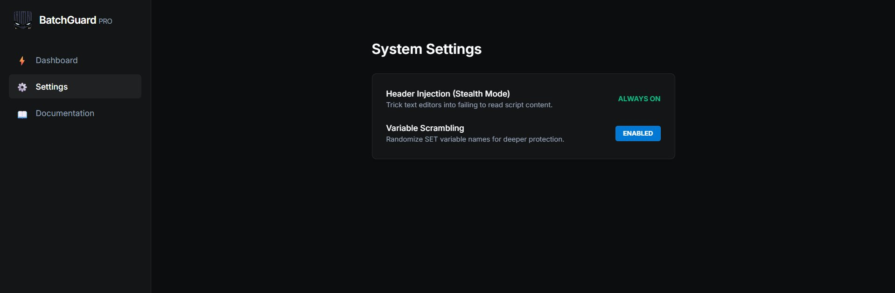
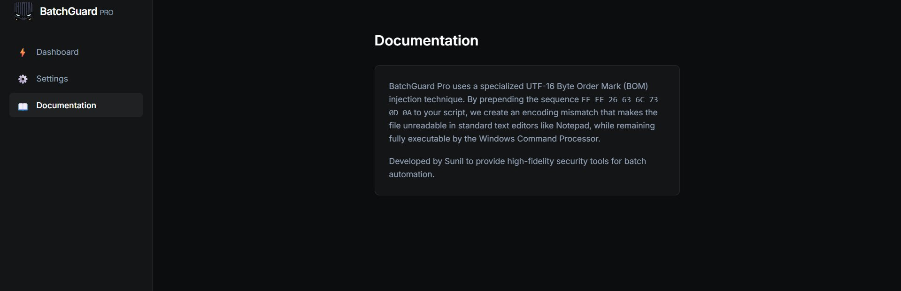

<div align="center">

<!-- ANIMATED DEMO BANNER -->


<br/>

<!-- TITLE BLOCK -->
```
██████╗  █████╗ ████████╗ ██████╗██╗  ██╗ ██████╗ ██╗   ██╗ █████╗ ██████╗ ██████╗ ██████╗  ██████╗ 
██╔══██╗██╔══██╗╚══██╔══╝██╔════╝██║  ██║██╔════╝ ██║   ██║██╔══██╗██╔══██╗██╔══██╗██╔══██╗██╔═══██╗
██████╔╝███████║   ██║   ██║     ███████║██║  ███╗██║   ██║███████║██████╔╝██║  ██║██████╔╝██║   ██║
██╔══██╗██╔══██║   ██║   ██║     ██╔══██║██║   ██║██║   ██║██╔══██║██╔══██╗██║  ██║██╔═══╝ ██║   ██║
██████╔╝██║  ██║   ██║   ╚██████╗██║  ██║╚██████╔╝╚██████╔╝██║  ██║██║  ██║██████╔╝██║     ╚██████╔╝
╚═════╝ ╚═╝  ╚═╝   ╚═╝    ╚═════╝╚═╝  ╚═╝ ╚═════╝  ╚═════╝ ╚═╝  ╚═╝╚═╝  ╚═╝╚═════╝ ╚═╝      ╚═════╝ 
                                               P R O
```

**Professional Batch Script Obfuscation & Security Utility for Windows**

[](https://react.dev)
[](https://vitejs.dev)
[](https://microsoft.com)
[](LICENSE)
[](https://github.com/Sunil56224972)

> *Make your `.bat` scripts invisible to eyes, readable only by machines.*

</div>

---

## 🎬 How It Works — In Action

> The animated banner above shows the complete app flow in real-time. Here are the individual screens:

<div align="center">

### 🖥️ Dashboard — Drag & Drop Your Script



### ⚙️ Settings — Fine-tune the Obfuscation Engine



### 📄 Documentation — Deep Technical Explanation



</div>

---

## 🔍 What Is BatchGuard Pro?

**BatchGuard Pro** is a sleek, dark-themed desktop web app built with **React + Vite** that lets you obfuscate Windows `.bat` (batch) scripts with a single drag-and-drop.

It uses a **UTF-16 BOM (Byte Order Mark) injection** technique — a clever binary trick that:

- 🚫 Makes your script **completely unreadable** in standard text editors (Notepad, VSCode opening as binary, etc.)
- ✅ Keeps the script **100% executable** by `cmd.exe` / Windows Command Processor
- 🔀 Optionally **scrambles all `SET` variable names** so even a hex editor sees gibberish

This is not a generic encoder. BatchGuard Pro injects a precise byte sequence `FF FE 26 63 6C 73 0D 0A` that exploits how text editors vs. the CMD interpreter handle encoding headers differently.

---

## ⚡ Features

| Feature | Description | Status |
|---|---|---|
| **Header Injection (Stealth Mode)** | Prepends UTF-16 BOM bytes to confuse text editors | `ALWAYS ON` |
| **Variable Scrambling** | Randomizes all `SET varname=` identifiers | `Toggleable` |
| **Drag & Drop Interface** | Zero-friction file loading from the Dashboard | ✅ |
| **One-Click Download** | Download your obfuscated `.bat` directly | ✅ |
| **Dark Pro UI** | Windows-11 inspired Mica-effect dark interface | ✅ |
| **No Server Needed** | Runs 100% client-side in your browser | ✅ |

---

## 🧠 The Obfuscation Technique — Deep Dive

### Phase 1: BOM Header Injection

```
Original file bytes:  40 65 63 68 6F ...   (@echo ...)
Obfuscated bytes:     FF FE 26 63 6C 73 0D 0A 40 65 63 68 6F ...
                      └──────────────────────┘ └──────────────
                         UTF-16 BOM + cls        Your script
```

**What happens:**
- A text editor like **Notepad** reads `FF FE` and says *"This is a UTF-16 Little-Endian file"* → tries to decode all content as UTF-16 → displays garbage / refuses to open
- **CMD.EXE** ignores encoding headers and executes raw bytes → your script runs perfectly

### Phase 2: Variable Scrambling *(optional)*

```batch
:: Before Scrambling
SET username=admin
SET password=secret123

:: After Scrambling  
SET xK3mQ9=admin
SET pR7vN2=secret123
```

Every `SET` variable name gets replaced with a random alphanumeric identifier. The script still functions identically — the variable references inside the logic are remapped too.

---

## 🚀 Getting Started

### Prerequisites

```bash
node >= 18.x
npm  >= 9.x
```

### Installation

```bash
# Clone the repo
git clone https://github.com/Sunil56224972/batchguard-pro.git
cd batchguard-pro

# Install dependencies
npm install

# Start development server
npm run dev
```

Open `http://localhost:5173` in your browser.

### Build for Production

```bash
npm run build
# Output is in /dist — can be served as a static site or wrapped in Electron
```

---

## 🗂️ Project Structure

```
batchguard-pro/
├── src/
│   ├── components/
│   │   ├── Sidebar.jsx          # Navigation sidebar (Dashboard/Settings/Docs)
│   │   └── DropZone.jsx         # Drag-and-drop file processor + obfuscation logic
│   ├── App.jsx                  # Root layout + tab state management
│   ├── main.jsx                 # React entry point
│   └── index.css                # Global styles + CSS variables (dark theme)
├── index.html                   # Vite HTML shell
├── package.json
└── vite.config.js
```

---

## 🎨 UI Design System

The interface is built on a custom CSS variable system inspired by **Windows 11 Mica effect**:

```css
--bg-color:       #0c0d0e   /* Deep black background      */
--surface-color:  #141517   /* Cards and panels           */
--primary-color:  #0078d4   /* Microsoft blue accent      */
--success-color:  #10b981   /* Green for confirmations    */
--text-secondary: #94a3b8   /* Muted descriptions         */
```

---

## 🛡️ Use Cases

- 🏢 **Enterprise batch automation** — protect deployment scripts from casual viewing
- 🔒 **IP protection** — ship `.bat` installers without exposing your logic
- 🧪 **Security research** — understand how encoding attacks affect script interpreters
- 🎓 **Education** — learn about binary file headers and encoding mismatches

---

## 📦 Tech Stack

```
Frontend:    React 19 + Vite 8
Styling:     Pure CSS + CSS Variables (no Tailwind, no UI lib)
Obfuscation: Vanilla JS (FileReader API + ArrayBuffer manipulation)
Build:       Vite (ESM)
Fonts:       Inter (Google Fonts)
```

---

## 🤝 Contributing

PRs are welcome. For major changes, open an issue first.

1. Fork the repo
2. Create your branch (`git checkout -b feature/my-feature`)
3. Commit changes (`git commit -m 'feat: add something cool'`)
4. Push and open a Pull Request

---

## 👤 Author

<div align="center">

**Sunil Dev**
*Self-taught developer & cybersecurity enthusiast from Chhattisgarh, India*

[](https://github.com/Sunil56224972)
[](https://instagram.com/kali_linux_user_)

*Part of the [rm -rf society](https://github.com/rm-rf-society) org*

</div>

---

## 📜 License

```
MIT License — do whatever you want, just don't remove the credits.
```

---

<div align="center">

**BatchGuard Pro** — *Because your scripts deserve better than plaintext.*

`rm -rf plaintext`

</div>
